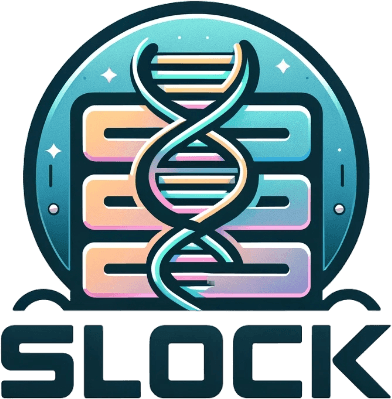

<!-- PROJECT LOGO -->
 

  

<h3 align="center">sLock</h3>

  

    ReGENerative for Kubernetesx
     
    <a href="https://github.com/mkm29/slock"><strong>Explore the docs »</strong></a>
     
     
    <a href="https://github.com/mkm29/slock">View Demo</a>
    ·
    <a href="https://github.com/mkm29/slock/issues">Report Bug</a>
    ·
    <a href="https://github.com/mkm29/slock/issues">Request Feature</a>
  

<!-- TABLE OF CONTENTS -->

  
Table of Contents

  <ol>
    <li>
      <a href="#about-the-project">About The Project</a>
    </li>
    <li>
      <a href="#getting-started">Getting Started</a>
      <ul>
        <li><a href="#prerequisites">Prerequisites</a></li>
      </ul>
    </li>
    <li>
      <a href="#usage">Usage</a>
      <ul>
        <li><a href="#basic-usage">Basic</a></li>
    </li>
    <li><a href="#features">Roadmap</a></li>
    <li><a href="#contributing">Contributing</a></li>
    <li><a href="#license">License</a></li>
    <li><a href="#contact">Contact</a></li>
    <li><a href="#acknowledgments">Acknowledgments</a></li>
  </ol>

<!-- ABOUT THE PROJECT -->
## About The Project

**sLOCK** is a simple yet fast AI-driven chat-API that uses [Langchain](https://www.langchain.com/) as well as [FastAPI](https://fastapi.tiangolo.com/). 

(<a href="#readme-top">back to top</a>)

<!-- GETTING STARTED -->

## Getting Started

__todo__

<!-- PREREQUISITES -->

### Prequisites

The following are required:

- [Poetry](https://python-poetry.org/)
- [Python](https://www.python.org/)

The following are optional:

- [Helm](https://helm.sh/docs/intro/install/)
- [Docker](https://docs.docker.com/get-docker/)
- [Kubernetes](https://kubernetes.io/docs/tasks/tools/install-kubectl/)

(<a href="#readme-top">back to top</a>)

<!-- USAGE EXAMPLES -->

## Usage

### Basic

__todo__

(<a href="#readme-top">back to top</a>)

<!-- FEATURES -->

## Features

- Standalone Langchain
  - [ ] Gemma (2b)
  - [ ] Gemma (7b)
  - [ ] Llama2 (7b)
- Server
    - [ ] Schemas
    - [ ] Protobuf
    - [ ] Endpoints
    - [ ] Authentication
    - [ ] Metrics (Prometheus)

See the [open issues](https://github.com/mkm29/slock/issues) for a full list of proposed features (and known issues/bugs).

(<a href="#readme-top">back to top</a>)

<!-- CONTRIBUTING -->

## Contributing

Contributions are what make the open source community such an amazing place to learn, inspire, and create. Any contributions you make are **greatly appreciated**.

If you have a suggestion that would make this better, please fork the repo and create a pull request. You can also simply open an issue with the tag "enhancement".
Don't forget to give the project a star! Thanks again!

1. Fork the Project
2. Create your Feature Branch (`git checkout -b feature/AmazingFeature`)
3. Commit your Changes (`git commit -m 'Add some AmazingFeature'`)
4. Push to the Branch (`git push origin feature/AmazingFeature`)
5. Open a Pull Request

(<a href="#readme-top">back to top</a>)

<!-- LICENSE -->

## License

Distributed under the MIT License. See [LICENSE](./LICENSE.md) for more information.

(<a href="#readme-top">back to top</a>)

 
<!-- ACKNOWLEDGMENTS -->

## Acknowledgments
 
* Lead Developer - Mitchell Murphy

(<a href="#readme-top">back to top</a>)

<!-- MARKDOWN LINKS & IMAGES -->
<!-- https://www.markdownguide.org/basic-syntax/#reference-style-links -->
